# pratikum.3
<h2>Tugas Bahasa Pemograman</h2>

<h3>Nama : Michael valentino laisina

kelas : TI.21.C1

Nim : 312110045

Membuat program menentukan bilangan terbesar dari 2 bilangan yang diinput kan oleh user menggunakan if stetment

Script : "1.py"
contoh script seperti berikut :

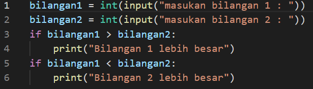

output yang dihasilkan :

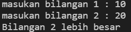

Membuat program mengurutkan bilangan terkecil sampai yang terbesar menggunakan if stetment yang di masukan dengan user 

Script : "2.py"
contoh script seperti berikut :

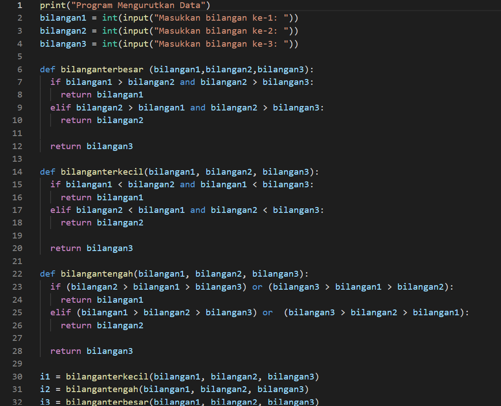

output yang dihasilkan :

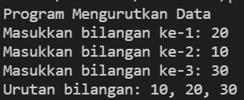

Membuat (Nested) menggunakan perintah perulangan for

Script : "3.py"

contoh script sebagai berikut :

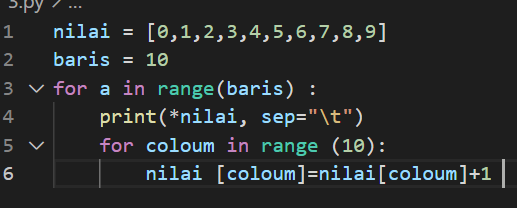

output yang dihasilkan :

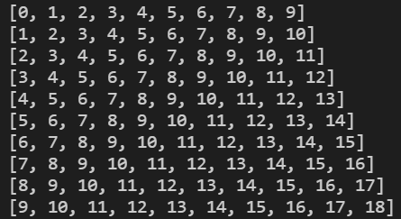

Membuat program angka acak/random sesuai berapa angka yang dimasukan oleh user kurang dari 0,5

Script : "4.py"

contoh script sebagai berikut :

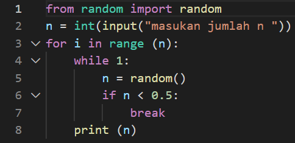

output yang dihasilkan :

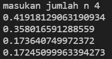

Membuat program mencari angka terbesar yang dimasukan oleh user menggunakan if stetment

Script : "2.1.py"
contoh script sebagai berikut :

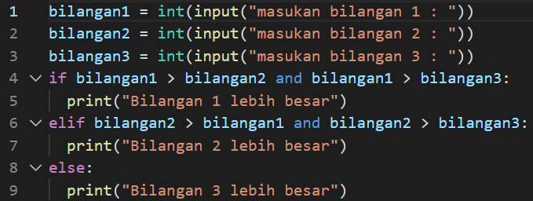

output yang dihasilkan :

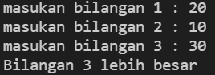

flowchart nya sebagai berikut :

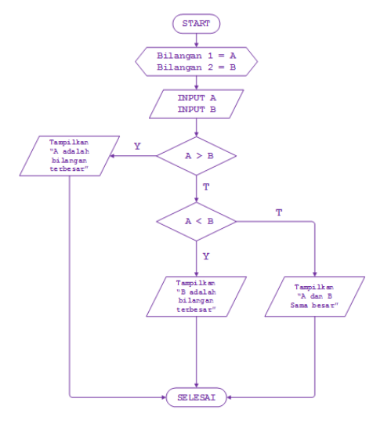

Membuat program angka random :

Script : "3.1.py"
contoh script sebagai berikut :

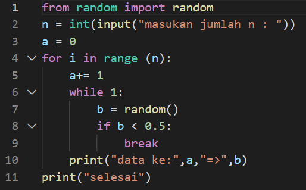

output yang dihasilkan :

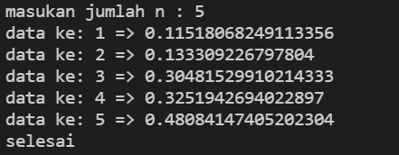

Membuat program menggunakan fungsi Break

Script : "3.2.py"

contoh script sebagai berikut :
 
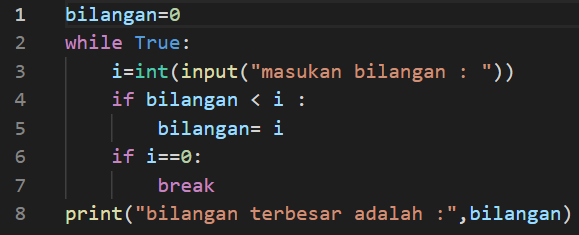

output yang dihasilkan :

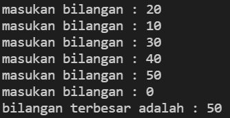

Membuat program untuk menghitung

Script : "3.3.py"

contoh script sebagai berikut :

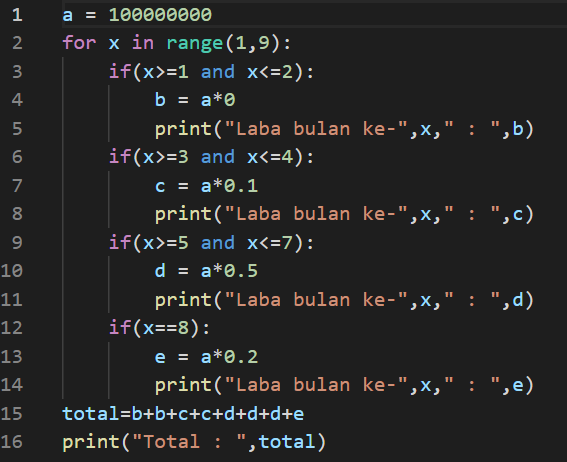

output yang dihasilkan :

</h3>

<h2>SELESAI</h2>

